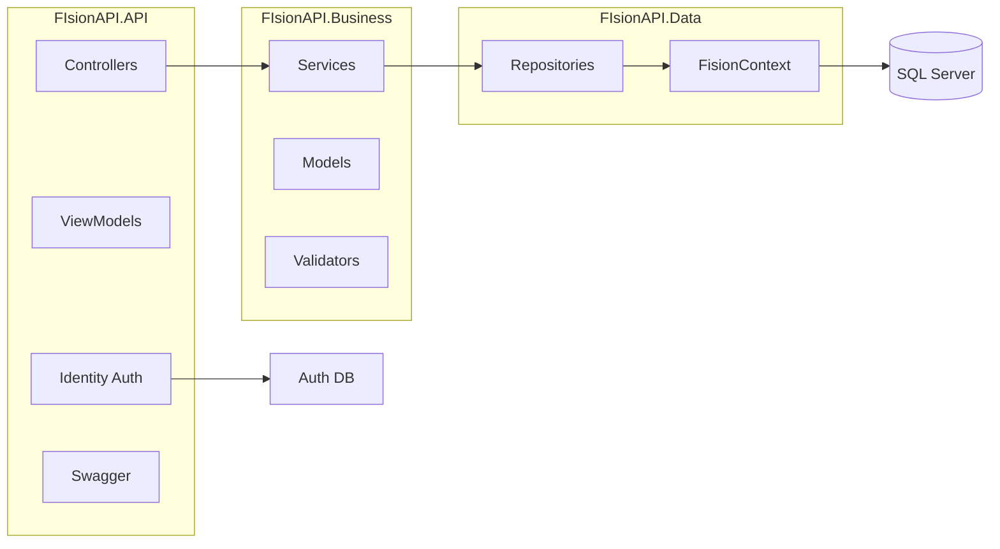

# Fision.API

API REST para gestão de entidades (alunos e profissionais), pessoas, contratos financeiros, movimentos financeiros e caixa. O domínio é voltado a clínica ou escola (por exemplo, fisioterapia): cadastro de pessoas, vínculo como Aluno ou Profissional, especialidades, contratos e fluxo de caixa.

## Para que serve o projeto

O **Fision.API** permite:

- **Cadastro de pessoas** – CPF, nome, data de nascimento, sexo, telefone, e-mail e endereço.
- **Entidades** – vínculo da pessoa com a organização (matrícula, datas de entrada/saída, classe Aluno ou Profissional, especialidade, contrato).
- **Gestão financeira** – contratos, movimentos financeiros (por entidade e avulsos) e caixa.

A API é versionada (v1) e expõe recursos como entidades, caixa e movimentos financeiros, com operações CRUD e endpoints específicos (atualizar endereço, contrato e pessoa da entidade). A autenticação é feita via ASP.NET Core Identity (Identity API Endpoints), com banco de dados separado para usuários.

### Principais entidades

| Entidade | Descrição |
|----------|-----------|
| **Pessoa** | Dados cadastrais e endereço |
| **Entidade** | Vínculo pessoa–organização (Aluno/Profissional), matrícula, especialidade, contrato |
| **Especialidades** | Especialidades disponíveis |
| **EnderecoPessoa** | Endereço da pessoa |
| **ContratoFinanceiro** | Contrato financeiro da entidade |
| **MovimentoFinanceiroEntidade** / **MovimentoFinanceiroAvulso** | Lançamentos financeiros |
| **Caixa** | Controle de caixa |

---

## Regras Cursor (.mdc)

As regras do Cursor ficam em `.cursor/rules/`:

### cursor-rules.mdc

- **Propósito:** Como adicionar e editar regras do Cursor no projeto.
- **Conteúdo:** Regras devem ficar em `PROJECT_ROOT/.cursor/rules/`, com nome em **kebab-case** e extensão **.mdc**. Cada arquivo tem frontmatter (`description`, `globs`, `alwaysApply`) e conteúdo em Markdown com instruções e exemplos. Não usar a raiz do projeto nem pastas fora de `.cursor/rules/` para regras.

### self-improvement.mdc

- **Propósito:** Diretrizes para melhorar as regras com base em padrões e boas práticas do código.
- **Aplicação:** Sempre ativa (`alwaysApply: true`).
- **Conteúdo:** Quando criar ou alterar regras (novos padrões, código repetido, erros evitáveis, novas libs). Processo: comparar código com regras, padronizar padrões, revisar tratamento de erros e testes. Adicionar regra quando uma tecnologia/padrão aparecer em 3+ arquivos, quando bugs puderem ser prevenidos ou quando surgirem padrões de segurança/performance. Inclui depreciação de regras e referência ao `cursor-rules.mdc` para formato.

---

## Tecnologias utilizadas

| Camada / Aspecto | Tecnologia |
|------------------|------------|
| **Runtime / Framework** | .NET 8.0 |
| **API** | ASP.NET Core (Web API), Startup + Program |
| **Banco de dados** | SQL Server, Entity Framework Core 8.0.22 |
| **ORM / Acesso a dados** | EF Core (DbContext, repositórios), EF Core Tools/Design |
| **Autenticação** | ASP.NET Core Identity (Identity API Endpoints), segundo DbContext para usuários |
| **Documentação API** | Swagger (Swashbuckle.AspNetCore 10.1.0) |
| **Versionamento API** | Microsoft.AspNetCore.Mvc.Versioning 5.0.0 (rotas `api/v1/...`) |
| **Mapeamento** | AutoMapper + Extensions.Microsoft.DependencyInjection |
| **Validação** | FluentValidation (projeto Business) |
| **Estrutura** | Solução em 3 projetos: API, Business, Data |

---

## Arquitetura

Fluxo: **Controller → Service (Business) → Repository (Data) → DbContext → SQL Server**. AutoMapper mapeia ViewModels e entidades; Identity usa um DbContext separado para autenticação.



---

## Estrutura da solução

| Projeto | Descrição |
|---------|-----------|
| **FIsionAPI.API** | Controllers (V1), ViewModels, configuração, autenticação, Swagger e injeção de dependências. |
| **FIsionAPI.Business** | Modelos de domínio, interfaces (repositórios e serviços), serviços e validações (FluentValidation). |
| **FIsionAPI.Data** | `FisionContext`, repositórios e configurações do EF Core (mapeamentos/migrations). |

Dependências: **API** referencia **Data**; **Data** referencia **Business**; **Business** é a camada de domínio e regras de negócio.

---

## Configuração local (banco de dados)

A API usa **dois bancos SQL Server** (duas connection strings):

| Chave | Uso |
|-------|-----|
| `DefaultConnection` | Domínio (`FisionContext` — entidades, pessoas, financeiro, etc.) |
| `AuthenticationConnection` | Identity (`AuthenticationDbContext` — usuários e perfis) |

**Não commite senhas ou servidores reais.** O repositório mantém `appsettings.json` com valores vazios; em desenvolvimento use um destes:

1. **Copiar o exemplo**  
   Copie `FIsionAPI.API/connectionstrings.Development.json.example` para `FIsionAPI.API/appsettings.Development.json` e ajuste servidor e nomes dos bancos. Esse arquivo já está no `.gitignore`.

2. **User Secrets (recomendado)**  
   O projeto `FIsionAPI.API` possui `UserSecretsId`; em desenvolvimento o host carrega segredos automaticamente.

   ```bash
   cd FIsionAPI.API
   dotnet user-secrets set "ConnectionStrings:DefaultConnection" "SUA_STRING_DOMINIO"
   dotnet user-secrets set "ConnectionStrings:AuthenticationConnection" "SUA_STRING_AUTH"
   ```

3. **Variáveis de ambiente** (útil em CI/Docker): `ConnectionStrings__DefaultConnection` e `ConnectionStrings__AuthenticationConnection`.

### Aplicar migrations (após definir as connection strings)

Na raiz do repositório (ajuste os caminhos se usar só uma pasta do projeto):

```bash
dotnet ef database update --project FIsionAPI.Data --startup-project FIsionAPI.API --context FisionContext

dotnet ef database update --project FIsionAPI.API --startup-project FIsionAPI.API --context AuthenticationDbContext
```

O `startup-project` precisa ser a API para carregar `appsettings` / User Secrets e as connection strings.

Instale a ferramenta global se ainda não tiver: `dotnet tool install --global dotnet-ef` (versão alinhada ao EF Core 8).
